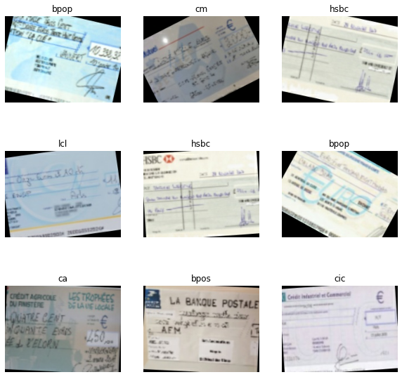
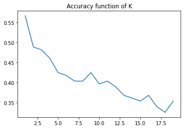
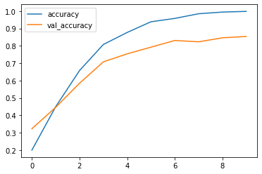
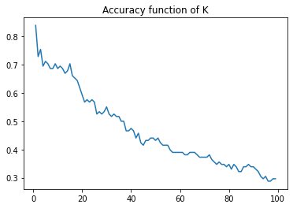

# Bank Cheques Classification

&copy; Maxence Raballand 2021

The goal here is to try to classify cheques by banks (french banks here) with a pretty small dataset (~60 images).

## Data augmentation

A big part of the process here is to augment our dataset. I augmented it by 10 times to have a dataset of around 600 images. For that I used OPEN cv and created function based on [this site](https://towardsdatascience.com/complete-image-augmentation-in-opencv-31a6b02694f5).

Filters are applied radomly based on probabilistic laws and parameters passed to the function.

```py
def single_transformation(img, hshift, vshift, lbright, hbright, zoom_ratio, chshift, hflip, vflip, rot, noise_prob):
    result = horizontal_shift(img, hshift)
    result = vertical_shift(result, vshift)
    result = brightness(result, lbright, hbright)
    result = zoom(result, zoom_ratio)
    result = channel_shift(result, chshift)
    result = horizontal_flip(result, hflip)
    result = vertical_shift(result, vflip)
    result = rotation(result, rot)
    result = sp_noise(result, noise_prob)
    return result
```

Here are some example of image using our data augmentation :



## Classification with a KNN

The use of a KNN is not ideal for image classification is not ideal here especially because of the modifications brought by data augmentation. However, the goal here is to try a basic machine learning algorithm for comparison.

I implemented a simple KNN [here](./knn.py) and the implementation for our use cas is [here](./KNN.ipynb). The image is a 3D object (height, width and color). So, first we will flatten the image matrix and then feed it as input data to our KNN (both for training and testing). The classification results are as such :



As we can see here, the results are pretty bad. Only 55% percent maximum accuracy with 1 neighbour (k=1). Actually, it is higher than expected (~10% was expected because there are a total of 13 classes). It may be due to our data augmentation technique were two close image can be present.

## Classification with VGG16 and a neural network

Then we will use a VGG16 convolutionnal network with imagenet weights. The code implementation for our use case can be found [here](./VGG16_with_nn.ipynb). We will freeze this model, then flatten the output and add 2 dense layers with the last one being a classification layer.

```py
normalization_layer = tf.keras.layers.Rescaling(1./255)

conv_base = tf.keras.applications.vgg16.VGG16(
    weights = "imagenet",
    include_top = False,
    input_shape = (img_height, img_width, 3)
)

conv_base.trainable = False

model = tf.keras.Sequential([
  normalization_layer,
  conv_base, 
  layers.Flatten(),
  layers.Dropout(.2),
  layers.Dense(64, activation='relu'),
  layers.Dense(len(class_names))
])

model.compile(optimizer='adam',
              loss=tf.keras.losses.SparseCategoricalCrossentropy(from_logits=True),
              metrics=['accuracy'])
```

With that, we get a validation accuracy of around 85% with a model slightly overfitting.



## Classification with VGG16 and a KNN

For one last test, I will use the output of the conv base from VGG16 as input to my already implemented KNN to see how it will work out. The implementation for our use case can be found [here](./VGG16_with_KNN.ipynb).

When preparing the data, I simply get the output of my VGG16, flatten it, and pass it to my KNN.

```py
model = tf.keras.Sequential([
    normalization_layer,
    conv_base,
    layers.Flatten()
])
```

To convert the image to our input data, we use this steps :

```py
img = np.array([cv2.imread(img_path)])
res = model.predict(img)
x.append(res[0])
y.append(i)
```

Here are the results :



The results are quite impressive as we get 83% maximum using this technique.

However, this can also be a critique towards our dataset that may be too much redondant, and as we can see, 83% are attained with only one neighbour. This means that it may be because images between train and test data are very close. The difference between a simple KNN is that VGG16 extract features regardless of modifications given to the image.
